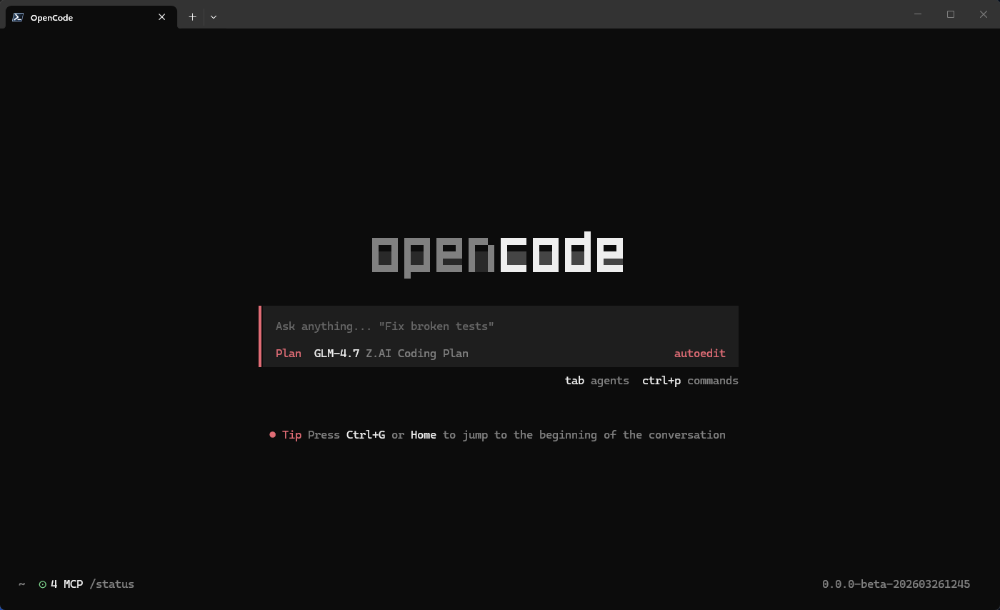
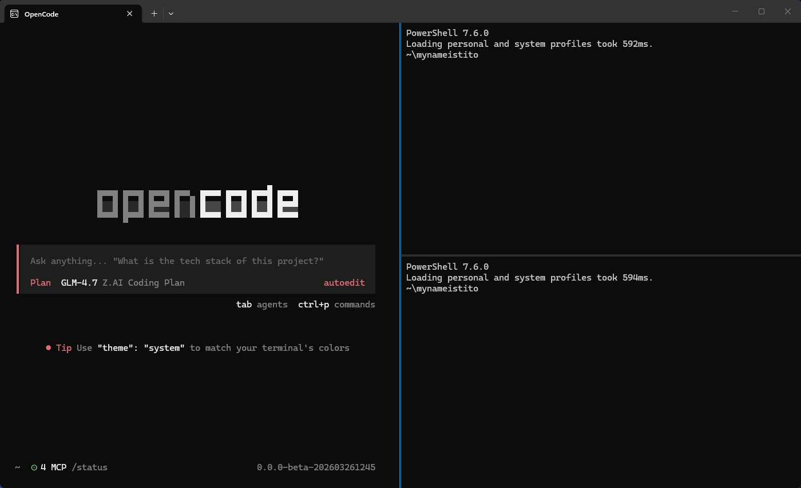

# opencode-dangerously-skip-permissions (windows)

Claude Code has a flag called `--dangerously-skip-permissions` that lets the AI run commands without asking you "are you sure?" every time. OpenCode doesn't have that flag. I got tired of approving every shell command mid-session, so I built my own version using environment variables, a couple PowerShell functions, and a red theme.

## What does this actually do?

Normally, OpenCode asks for your permission before it runs any tool (shell commands, file edits, etc.). That's a good safety feature. But when you're deep in a coding session and you trust what the model is doing, constantly hitting "approve" gets old fast.

This repo gives you a way to skip all those permission prompts, just like Claude Code's `--dangerously-skip-permissions` flag. Instead of typing a long flag every time, you just type `ocd` and you're in.

The trick is two environment variables that OpenCode checks on startup:

- `OPENCODE_PERMISSION`: tells OpenCode which tools to auto-approve. Setting it to `{"*":"allow"}` means "approve everything, don't ask me"
- `OPENCODE_TUI_CONFIG`: tells OpenCode where to find its UI config file. We point this at a config that loads a red theme, so you always know when permissions are off

## What's in this repo

```
.config/
  opencode/
    tui.json                          # normal TUI config (orange theme)
    tui-danger.json                   # danger TUI config (red theme)
    themes/
      opencode-win.json               # the normal color theme
      opencode-win-danger.json        # the red "danger mode" color theme
```

Plus two PowerShell functions you add to your profile (explained below).

## The functions

You'll add these to your PowerShell profile so they're available every time you open a terminal.

### `ocd` (the simple one)

```powershell
function global:ocd { # "opencode --dangerously-skip-permissions"
    $env:OPENCODE_TUI_CONFIG = "$env:XDG_CONFIG_HOME/opencode/tui-danger.json"
    $env:OPENCODE_PERMISSION = '{"*":"allow"}'
    opencode @args
}
```

Here's what each line does:

1. Points `OPENCODE_TUI_CONFIG` at the danger config (which loads the red theme)
2. Sets `OPENCODE_PERMISSION` to allow all tools without asking
3. Runs `opencode`, forwarding any arguments you passed (like a project path)

So instead of doing a bunch of setup every time, you just type `ocd` and go.

<p align="center">
  
</p>

### `ocds` (the fancy one, with split panes)

```powershell
function global:ocds { # "opencode --dangerously-skip-permissions" (tri-slip format)
   $env:OPENCODE_TUI_CONFIG = "$env:XDG_CONFIG_HOME/opencode/tui-danger.json"
   $env:OPENCODE_PERMISSION = '{"*":"allow"}'
   & $wtp -w 0 new-tab -d $PWD opencode @args `; split-pane -V -s 0.5 -d $PWD `; split-pane -H -d $PWD `; focus-pane -t 0
}
```

Same two env vars as `ocd`, but instead of just running OpenCode, it opens a new tab in Windows Terminal with three panes:

- The top pane runs OpenCode (this is where your cursor lands)
- The bottom-left pane is an empty shell (handy for running commands yourself)
- The bottom-right pane is another empty shell (maybe for logs, git, whatever you want)

It always opens in a new tab (`new-tab`), so it won't mess with whatever you already have open.

<p align="center">
  
</p>

`$wtp` is a variable I set in my profile that points to the Windows Terminal executable. I use Windows Terminal Preview, so mine looks like this:

```powershell
# Windows Terminal Preview
$wtp = "$env:LOCALAPPDATA\Microsoft\WindowsApps\Microsoft.WindowsTerminalPreview_8wekyb3d8bbwe\wt.exe"
```

If you use regular Windows Terminal (not Preview), the path is:

```powershell
# Windows Terminal (stable)
$wtp = "$env:LOCALAPPDATA\Microsoft\WindowsApps\Microsoft.WindowsTerminal_8wekyb3d8bbwe\wt.exe"
```

Add whichever one you use to your `$PROFILE` so the `ocds` function can find it.

If you don't use Windows Terminal at all, you can skip this function entirely and just use `ocd`.

## Where does your PowerShell $PROFILE live?

Your PowerShell profile is a script that runs automatically every time you open a new PowerShell window. It's where you put functions, aliases, and settings you want available in every session.

On Windows with PowerShell 7+, it's usually at:

```
C:\Users\<YourUsername>\Documents\PowerShell\Microsoft.PowerShell_profile.ps1
```

Not sure where yours is? Open PowerShell and type:

```powershell
$PROFILE
```

It'll print the full path. If the file doesn't exist yet, create it:

```powershell
New-Item -Path $PROFILE -ItemType File -Force
```

Then open it in any text editor and paste in the functions.

## The config files explained

### `tui.json` (your normal config)

This is the everyday OpenCode config. It sets the theme to `opencode-win` (the orange one) and adds some custom keybinds for navigating between sessions:

```json
{
  "$schema": "https://opencode.ai/tui.json",
  "theme": "opencode-win",
  "keybinds": {
    "session_parent": "ctrl+up",
    "session_child_cycle_reverse": "ctrl+left",
    "session_child_cycle": "ctrl+right",
    "session_child_first": "ctrl+down"
  },
  "scroll_speed": 10,
  "scroll_acceleration": {
    "enabled": true
  }
}
```

You can tweak the keybinds and scroll settings to your liking. The schema URL gives your editor autocomplete if it supports JSON schemas.

### `tui-danger.json` (the danger config)

Exactly the same as `tui.json`, but the theme is set to `opencode-win-danger` instead of `opencode-win`. That's the only difference. When you run `ocd` or `ocds`, the env var points OpenCode at this file, and it loads the red theme.

### `themes/opencode-win.json` (normal theme)

A warm dark theme I put together for Windows Terminal. Orange primary (`#fab283`), purple accent (`#9d7cd8`), blue secondary (`#5c9cf5`). Has both dark and light mode variants.

### `themes/opencode-win-danger.json` (the red theme)

Same colors as the normal theme for most things, but the primary, secondary, and accent colors are all swapped to red (`#e06c75` in dark mode, `#d1383d` in light mode). Markdown headings go red. Syntax keywords go red. The whole UI takes on a red tint so you can't accidentally forget you're running without permission checks.

Here's a quick comparison of what changes:

| What | Normal | Danger |
|---|---|---|
| primary | orange (`darkStep9`) | red (`darkRed`) |
| secondary | blue (`darkSecondary`) | red (`darkRed`) |
| accent | purple (`darkAccent`) | red (`darkRed`) |
| warning | orange (`darkOrange`) | red (`darkRed`) |
| markdown headings | purple (`darkAccent`) | red (`darkRed`) |
| syntax keywords | purple (`darkAccent`) | red (`darkRed`) |

## Installation (step by step)

### 1. Clone this repo

```bash
git clone https://github.com/mynameistito/opencode-dangerously-skip-permissions.git
cd opencode-dangerously-skip-permissions
```

### 2. Figure out where your OpenCode config lives

OpenCode looks for config files in `$XDG_CONFIG_HOME/opencode/`. On Windows, `$XDG_CONFIG_HOME` is usually `~/.config` (which expands to `C:\Users\<YourUsername>\.config`).

Check if yours is set:

```powershell
$env:XDG_CONFIG_HOME
```

If that prints something, great, that's your config root. If it prints nothing, your config goes in `~/.config/opencode/`.

### 3. Copy the config files

```powershell
# If XDG_CONFIG_HOME is set:
Copy-Item -Recurse .config/opencode/* "$env:XDG_CONFIG_HOME/opencode/"

# If it's not set, use the default:
Copy-Item -Recurse .config/opencode/* "$HOME/.config/opencode/"
```

This copies the TUI configs and both themes into the right place.

### 4. Add the functions to your PowerShell profile

Open your profile in a text editor:

```powershell
notepad $PROFILE
```

Paste in the `ocd` function (and `ocds` too, if you use Windows Terminal). Save and close.

If you want `ocds`, also add this line somewhere in your profile so it knows where Windows Terminal is:

```powershell
# Windows Terminal Preview
$wtp = "$env:LOCALAPPDATA\Microsoft\WindowsApps\Microsoft.WindowsTerminalPreview_8wekyb3d8bbwe\wt.exe"
```

If you use regular Windows Terminal (not Preview), the path is:

```powershell
# Windows Terminal (stable)
$wtp = "$env:LOCALAPPDATA\Microsoft\WindowsApps\Microsoft.WindowsTerminal_8wekyb3d8bbwe\wt.exe"
```

### 5. Reload your profile

You don't need to close and reopen PowerShell. Just run:

```powershell
. $PROFILE
```

The dot-space before `$PROFILE` tells PowerShell to run the script in your current session (instead of in a child process that would lose the changes).

### 6. Try it out

```powershell
ocd
```

If everything worked, OpenCode should launch with a red-tinted UI. That red is your reminder that all permissions are being auto-approved.

## Fair warning

This skips every permission check. OpenCode will run shell commands, edit files, and do whatever the model decides without asking you first. I use it when I trust the task and want uninterrupted flow, but you should understand what that means before you turn it on. If a model decides to `rm -rf` something, nothing is going to stop it. You've been warned.

## License
MIT

##  Notes
Found this cool? Consider staring it or flicking me a follow on here or X [@mynameistito](https://x.com/mynameistito)

If you have issues feel free to reach out / create an Issue and I'll try where I can
